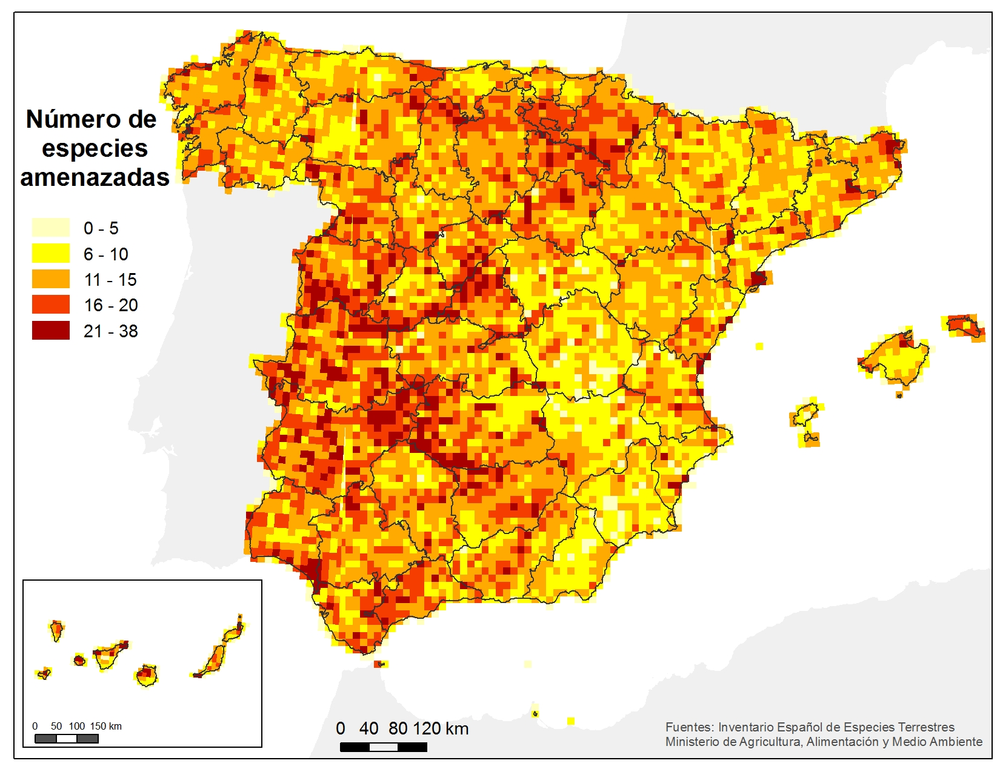
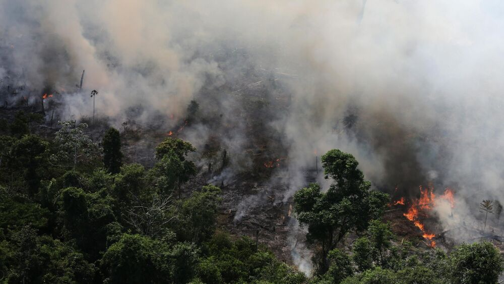

# 🐾 **SISTEMA DE IDENTIFICACIÓN DE ANIMALES EN PELIGRO DE EXTINCIÓN**

---

## 🚀 Potencial Aporte

- ✅ **Identificación automatizada** de especies amenazadas a partir de datos confiables y actualizados.
- 📊 **Análisis en tiempo real** sobre el impacto del cambio climático en hábitats naturales, cruzando información climática y ecológica.
- 🗺️ **Visualización interactiva** con mapas que muestran zonas de distribución y nivel de amenaza, facilitando la comprensión para diversos públicos.
- 🧠 **Soporte para la toma de decisiones**, permitiendo a gobiernos, ONGs y centros de investigación enfocar esfuerzos de conservación basados en datos.

  

---

## 🌍 Relevancia del Proyecto

- 🆘 **Contexto actual de crisis ecológica:** En un momento crítico de pérdida acelerada de biodiversidad, contar con herramientas tecnológicas que integren y comuniquen información actualizada es vital para proteger el equilibrio ecológico.
- 💡 Promueve el **uso de tecnologías sostenibles**, demostrando cómo la programación y el análisis de datos pueden ser aliados de la conservación ambiental.

---

## 🌐 **Fuentes de Datos**

---

### 📰 **Bing News Search API – Noticias sobre fauna y medio ambiente**
**🔍 Objetivo** 
Obtener noticias actualizadas de medios reconocidos a nivel global relacionadas con especies en peligro de extinción, pérdida de hábitat, cambio climático, caza ilegal y conservación.

**🔧 Acceso**
- Sitio: [Bing News Search API](https://www.microsoft.com/en-us/bing/apis/bing-news-search-api)
- Acceso mediante una cuenta gratuita en Azure Portal
- Requiere crear un recurso y obtener una **clave de API** y un **endpoint**
- Consultas disponibles mediante peticiones HTTP (RESTful) o usando la biblioteca `requests` en Python

#### 📥 Datos disponibles
- Título de la noticia  
- Resumen o descripción del contenido  
- Fecha de publicación  
- Medio de comunicación (ej. BBC, El País, National Geographic)  
- Enlace directo a la noticia  
- Categorías temáticas (si están disponibles)  
- Imagen destacada (en algunos casos)

---

### 🐾 **UICN – Lista Roja de Especies en Peligro**

**🔍 Objetivo**  
Obtener información científica y oficial sobre el estado de conservación de especies amenazadas a nivel global.

**🔧 Acceso**  
- Sitio: [UICN Red List](https://www.iucnredlist.org)  
- API: [API v3](https://apiv3.iucnredlist.org/api/v3)  
- Requiere registro gratuito y token

**📥 Datos disponibles**  
- Estado de conservación (ej. “EN” = En Peligro, “CR” = Crítico)  
- Descripción de amenazas y acciones de conservación  
- Lista de países donde habita la especie  
- Estimación de individuos restantes

---

### 🌍 **GBIF – Plataforma Global de Información sobre Biodiversidad**

**🔍 Objetivo**
Obtener datos geográficos y temporales sobre **avistamientos u ocurrencias** de especies silvestres.

**🔧 Acceso**  
- Sitio: [GBIF](https://www.gbif.org)  
- API: [GBIF Developer Summary](https://www.gbif.org/developer/summary) 
- Accesible mediante peticiones HTTP o con el paquete `pygbif` en Python

**📥 Datos disponibles**  
- Coordenadas de ocurrencia (latitud y longitud)  
- Fecha del registro (año, mes, día)  
- Número de registros por país o región  
- Fuente del dato (observación directa, sensores, registros históricos)

---

### ☀️ **OpenWeatherMap – Datos Climáticos y Eventos Extremos**

**🔍 Objetivo**
Obtener condiciones ambientales actuales e históricas en regiones donde viven especies amenazadas.

**🔧 Acceso**  
- Sitio: [OpenWeatherMap](https://openweathermap.org/api)  
- Requiere **API Key gratuita**

**📥 Datos disponibles** 
- Temperatura actual y media  
- Precipitaciones  
- Incendios activos  
- Calidad del aire  
- Eventos climáticos extremos (sequías, olas de calor)

---

Estas fuentes permiten integrar información científica, ambiental y mediática en un sistema unificado para monitorear y visualizar la situación de especies amenazadas en todo el mundo.

---

## 🌿 **Objetivos y Productos Finales**

---

### 🐼 **Objetivo General**

Se busca utilizar herramientas digitales para la **recolección**, **análisis** y **visualización de datos** sobre **especies en peligro de extinción**, relacionando esta información con **reportes noticiosos** y **eventos climáticos** que afectan críticamente sus hábitats.  
El fin último es **generar conciencia ambiental** y contribuir a una **toma de decisiones informada** frente a la pérdida de biodiversidad.

  

---

### 🐼 **Objetivos Específicos**

- 📚 **Recolectar información** desde fuentes confiables, como la **Lista Roja de la UICN**, portales climáticos y bases de datos de biodiversidad.
- 📰 **Detectar noticias recientes** que informen sobre la **pérdida de hábitats** o **amenazas directas** a especies en peligro.
- 🔥 **Analizar la relación** entre el **cambio climático** (temperaturas extremas, sequías, incendios) y la **reducción de los ecosistemas naturales**.
- 🗺️ **Visualizar geográficamente** las especies afectadas y su nivel de amenaza mediante **mapas interactivos**.
- 📊 **Desarrollar un dashboard interactivo** que permita al usuario **explorar la información por especie, región o tipo de amenaza**, en un entorno accesible y comprensible.

---

## 🌿 **Resultado Final del Proyecto**

Con el proyecto se busca un sistema funcional capaz de:

- 🔗 **Consultar múltiples APIs** de datos ambientales y noticiosos de forma automatizada.
- 📌 **Detectar menciones** de especies y amenazas relevantes en medios de comunicación.
- 🗺️ **Generar un mapa interactivo** que muestre la distribución de especies amenazadas, filtrable por país, especie o tipo de riesgo.
- 💻 **Presentar la información** en una **interfaz web amigable**, enfocada en el usuario, con énfasis en la **comunicación visual**, dejando de lado tecnicismos innecesarios.
- 🌱 **Contribuir a la concientización** y **sensibilización de la comunidad** mediante la presentación **clara, visual y accesible** de datos críticos sobre la biodiversidad global.

### 💡 **Ejemplo de caso de uso**

- **Especie:** *Jaguar*  
- **Noticia detectada:** "Disminuye el hábitat del jaguar en México por incendios y agricultura"  
- **Clima:** Temperaturas + sequías en región mencionada  
- **Mapa:** Se traza su distribución actual + zonas afectadas por cambio climático  
- **Alerta:** Quedan ~14,000 ejemplares en estado salvaje

  

---

